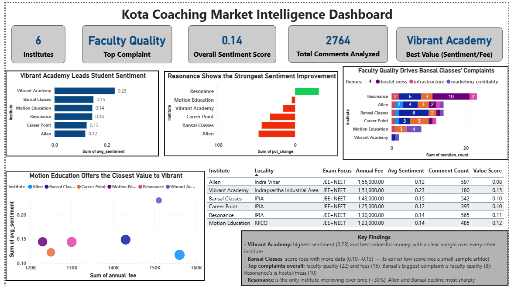

# Kota Coaching Market Intelligence Dashboard

A market intelligence project analyzing public sentiment, complaint patterns, and value-for-money across 6 major coaching institutes in Kota — built on 2,764 YouTube comments collected via the YouTube Data API v3, and analyzed using Python, SQL (SQLite), NLP, and Power BI.

Unlike many portfolio analytics projects, the dataset was collected directly through the YouTube Data API and processed through a custom data pipeline rather than sourced from a pre-packaged public dataset.

## Why this project

Coaching institutes in Kota spend heavily on marketing claims (selection results, "India's #1") but there is little public, structured competitive intelligence on what students and parents actually think, where real complaints concentrate, or which institutes deliver the best value relative to their fees. This project builds that intelligence from scratch.

## Key Findings

| Institute        | Avg. Sentiment     | Comments Analyzed | Annual Fee              | Value Score\*   | Sentiment Trend             |
| ---------------- | ------------------ | ----------------- | ----------------------- | --------------- | --------------------------- |
| Vibrant Academy  | **0.23** (highest) | 180               | ₹1,51,000               | **0.15** (best) | -15.2%                      |
| Bansal Classes   | 0.15               | 542               | ₹1,43,000               | 0.10            | -42.9%                      |
| Motion Education | 0.14               | 485               | ₹1,23,000               | 0.12            | -4.3%                       |
| Resonance        | 0.14               | 565               | ₹1,30,000               | 0.11            | **+30.5%** (only improving) |
| Career Point     | 0.12               | 395               | ₹1,25,000               | 0.10            | -32.3%                      |
| Allen            | 0.12               | 597               | ₹1,56,000 (highest fee) | 0.08 (lowest)   | -46.9%                      |

\*Value Score = average sentiment ÷ (annual fee / ₹100,000) — sentiment delivered per rupee spent.

## Example Business Question Answered

Which coaching institute delivers the strongest student sentiment relative to annual fees?

Result:
Vibrant Academy achieved the highest value score (0.15), while Allen delivered the lowest sentiment-per-fee ratio despite charging the highest annual fee.

**Other notable findings:**

- **Faculty quality** (22 mentions) and **fees** (16) are the most-named specific complaints overall, but the _type_ of complaint varies sharply by institute: Bansal Classes' complaints concentrate on faculty quality, while Resonance's concentrate on hostel/mess quality (10 mentions, its single largest category).
- Several complaint categories (e.g. marketing credibility, batch placement concerns) were **100% negative whenever mentioned** — these aren't neutral discussion topics, they only ever come up as complaints.
- Three competing institutes (Resonance, Bansal Classes, Career Point) operate out of the **same neighborhood (IPIA)** — a real geographic competitive cluster.
- Resonance is the only institute with improving sentiment over the observed comment history; the rest are declining, most sharply Allen and Bansal.

## Business Value

This project demonstrates how publicly available student feedback can be transformed into competitive intelligence for an industry that otherwise relies almost entirely on self-reported marketing claims.

Potential users include:

- New coaching institutes evaluating market positioning before entering Kota
- Education consultants comparing competitors on dimensions beyond advertised results
- Parents and students seeking independent sentiment indicators alongside official claims
- Investors or operators assessing brand perception relative to pricing

## Skills Demonstrated

- API Integration (YouTube Data API v3)
- Data Collection & Data Cleaning
- NLP & Sentiment Analysis
- Custom Hinglish Lexicon Engineering
- SQL (CTEs, Window Functions, Joins)
- SQLite Database Design
- Power BI Dashboard Development
- Business Intelligence & Competitive Analysis

## Dashboard Preview

Power BI dashboard showing institute sentiment rankings, complaint themes, value-for-money analysis, and sentiment trend comparisons.



## Methodology

### 1. Data Collection

- **Source:** YouTube Data API v3 (free tier, no billing required) — searched for review/vlog videos per institute, pulled top-level comments.
- **Two collection passes:** an initial pass across all 6 institutes, followed by a targeted second pass specifically for under-represented institutes (Resonance, Career Point, Motion, Bansal) to address a sample-size imbalance discovered during review. The second pass increased coverage from 838 comments to 2,764 comments and substantially reduced the initial sample-size imbalance across institutes, though some difference in sample size across institutes remains (see Limitations).
- **Fee/locality data:** manually researched from each institute's official website and cross-checked for unit consistency (annual vs. multi-year totals were not mixed).

### 2. Data Cleaning

- Removed exact duplicate comments (videos overlapping across search queries).
- **Institute label reconciliation:** a comment is initially labeled by which search query found it, but the comment text itself sometimes names a _different_ institute (e.g. a comment under an Allen-search video that's actually about Motion). Comments were re-attributed to the institute they actually discuss, rather than discarded.
- **Comment-type classification:** roughly a third of raw comments turned out to be viewer questions/requests directed at the video creator ("bhaiya please review X"), not opinions about an institute. These are kept in the dataset for transparency but excluded from sentiment metrics.

### 3. NLP / Sentiment Analysis

- Base sentiment scoring via VADER, extended with a **custom Hinglish lexicon** (e.g. "achi" → positive, "bekar" → negative) built by manually reading real comments rather than guessing slang in advance.
- **Phrase-level idiom correction:** lexicon-based tools misread common Indian-internet praise idioms as negative (e.g. "hated by many, defeated by none" uses negative words to mean "so good it draws envy"). A small override layer corrects known cases; this is documented as an inherent limitation of lexicon-based sentiment, not silently hidden.
- Pure Devanagari-script comments are flagged and excluded from scoring rather than mis-scored.
- Complaint themes assigned via a keyword dictionary across 7 categories (faculty quality, batch size/placement, fees, hostel/mess, academic pressure, infrastructure, marketing credibility), refined twice against real data.

### 4. Database & SQL

All processed data is loaded into a SQLite database (`coaching_intel.db`). Example queries (`queries.sql`) demonstrate:

- CTEs + window functions (ranking each institute's top complaint theme; ranking institutes by sentiment trend)
- JOINs (computing what % of mentions for each theme are actually negative)
- GROUP BY / HAVING (filtering to institutes with statistically reliable sample sizes)

### 5. Dashboard

Built in Power BI: KPI summary cards, sentiment-by-institute ranking, fee-vs-sentiment value analysis, complaint theme breakdown, sentiment trend, and a locality/fee reference table — all backed by the same underlying tables as the SQL queries above.

## Limitations

- **Role-based attribution (parent vs. student complaints) was attempted but abandoned** — it required comments to explicitly self-identify ("my son...", "I am preparing..."), which proved too rare in the dataset to yield reliable results.
- Some institutes still have meaningfully smaller comment samples than others even after rebalancing (Vibrant Academy: 180 vs. Allen: 597); the dashboard flags this rather than treating all averages as equally reliable.
- A portion of negative comments remain "uncategorized" — i.e., genuinely negative but without a stated, specific reason. This was treated as a real result to report, not a gap to force-fill with invented categories.
- Institute label reconciliation relies on keyword/alias matching, not perfect entity resolution.

## Tech Stack

`Python` (Pandas, NumPy, VADER) · `SQL` (SQLite — CTEs, window functions, joins) · `Power BI` (DAX, conditional formatting, KPI cards) · `YouTube Data API v3`

## Repository Structure

```
├── collect_youtube_comments.py        # Batch 1 data collection
├── collect_youtube_comments_batch2.py # Batch 2 (targeted rebalancing)
├── clean_raw_comments.py              # Dedup + institute label reconciliation
├── analyze_comments.py                # Sentiment, theme tagging, SQLite export
├── queries.sql                        # Example SQL analysis
├── institute_reference.csv            # Manually researched fee/locality data
├── coaching_intel.db                  # SQLite database (all processed tables)
└── *.csv                              # Individual output tables (dashboard sources)
```

## How to Reproduce

1. Get a free YouTube Data API key (console.cloud.google.com — no billing required).
2. Run `collect_youtube_comments.py`, then `collect_youtube_comments_batch2.py` (in Google Colab or locally).
3. Run `clean_raw_comments.py`, then `analyze_comments.py`.
4. Open `coaching_intel.db` in any SQL tool, or load the output CSVs into Power BI.
